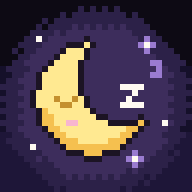
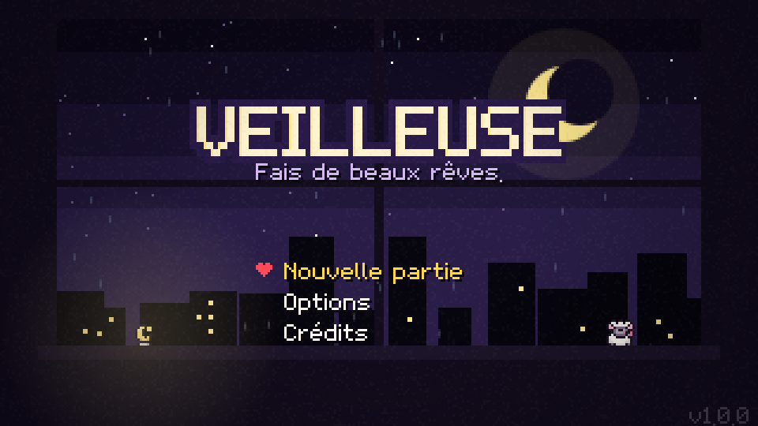
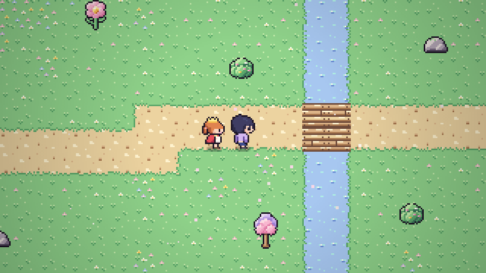
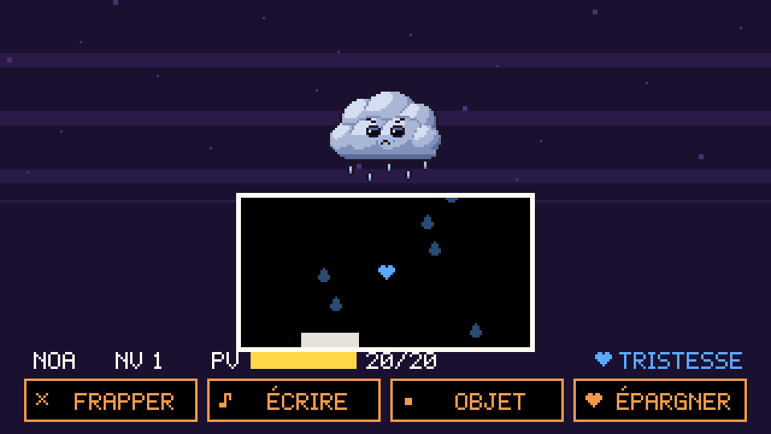
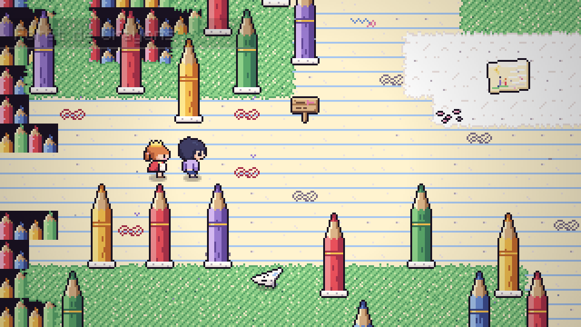
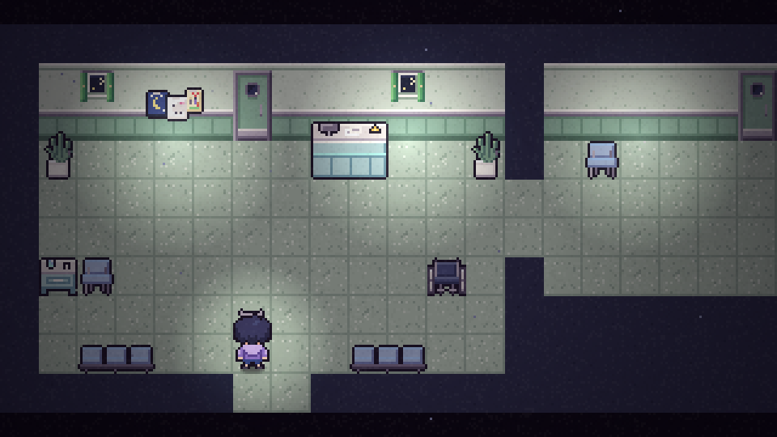
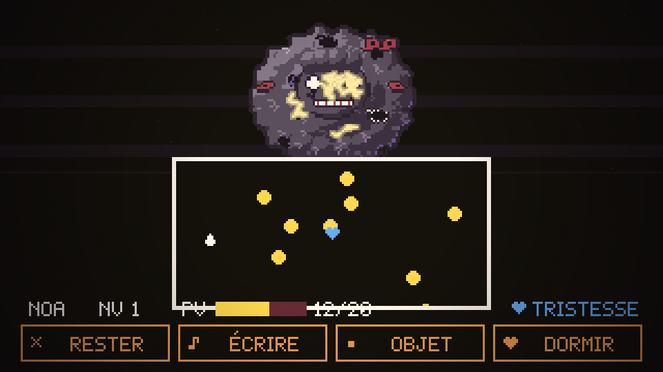

<div align="center">



# VEILLEUSE

***Fais de beaux rêves.***

Un RPG narratif en pixel art sur le deuil, les rêves et la lumière qu'on laisse allumée pour quelqu'un.<br/>
Inspiré d'*Undertale*, d'*OMORI* et de *Doki Doki Literature Club*.

[](https://github.com/Yato-350/Veilleuse/actions/workflows/ci.yml)
[](https://github.com/Yato-350/Veilleuse/actions/workflows/deploy.yml)


**[▶ Jouer dans le navigateur](https://yato-350.github.io/Veilleuse/)**

</div>

<div align="center">








<sub>Jouable au clavier, à la manette et au tactile — <a href="docs/screenshots/07-mobile.png">aperçu sur téléphone</a>.</sub>

</div>

> ⚠️ **Avertissement** — Ce jeu aborde le deuil, la maladie d'un enfant, la culpabilité et des pensées sombres. Il
> contient des scènes et des effets visuels pouvant être perturbants. Si tu traverses un moment difficile, parles-en :
> en France, le **3114** répond 24h/24.

---

## L'histoire

Noa, 14 ans, ne sort plus de sa chambre depuis un an. Il fait toujours nuit. Une nuit, **Dodo**, le mouton en
peluche de sa petite sœur, se met à parler :

> « Tu ne dors pas ? Viens. Je connais un endroit où personne n'est jamais triste. »

Sous le lit s'ouvre le **Pays de Coton**, un monde dessiné aux crayons de couleur où **Mina** est là, couronne de
papier sur la tête, comme si rien ne s'était passé. Chaque nuit, Noa s'enfonce un peu plus loin dans le rêve. Chaque
matin, l'appartement est un peu plus sombre, et la porte de la chambre de Mina reste fermée.

**Prologue · 3 chapitres oniriques · 2 interludes dans le monde réel · un final · 3 fins.**

## Le système de combat *Plume & Cœur*

Un combat au tour par tour avec des phases d'esquive en temps réel, où **les mots comptent plus que les coups**.

| Commande | |
|---|---|
| ✕ **FRAPPER** | barre de timing ; vaincre un ennemi donne de l'**Encre**… et assombrit l'histoire |
| ♪ **ÉCRIRE** | ouvre le carnet : choisis **un mot** parmi six pour répondre au besoin émotionnel de l'ennemi |
| • **OBJET** | soins, et objets qui changent ton émotion |
| ♥ **ÉPARGNER** | quand son nom devient jaune, l'ennemi part en paix : tu gagnes des **Étoiles** |

Chaque mot écrit **change la couleur de ton cœur** — Joie, Tristesse, Colère — et la règle d'or s'applique :

> **Un projectile de la même couleur que ton cœur te traverse sans te blesser.**

Écrire un mot triste à un Nuage Triste l'apaise *et* rend ton cœur bleu : sa pluie bleue ne te touche plus.
L'empathie protège, littéralement.

## Jouer

| | Clavier | Manette | Tactile |
|---|---|---|---|
| Se déplacer | Flèches · ZQSD · WASD | Stick · croix | Croix virtuelle (ou glisser pendant l'esquive) |
| Valider / examiner | Entrée · Espace · Z (W en AZERTY) | A | A · toucher l'écran |
| Annuler / courir | Échap · X · Maj | B | B |
| Menu | C · Tab | Start | ☰ |

### Installer sur mobile (Android · iPhone · iPad)

Le jeu est une **Progressive Web App** : une fois installé, il se lance en plein écran depuis l'écran d'accueil et
fonctionne **hors-ligne**.

- **Android (Chrome)** : ouvrir le jeu → menu ⋮ → *Installer l'application* (ou « Installer le jeu » sur l'écran titre).
- **iPhone / iPad (Safari)** : ouvrir le jeu → bouton *Partager* → *Sur l'écran d'accueil*.
- **Ordinateur (Chrome, Edge)** : icône d'installation dans la barre d'adresse.

En portrait, l'écran prend une disposition « console portable » avec les contrôles en dessous ; en paysage, les
contrôles se placent sur les côtés.

**Application Android (APK)** : le workflow [Android APK](.github/workflows/android.yml) emballe le jeu avec
Capacitor. Lancez-le depuis l'onglet *Actions* (ou poussez un tag `v1.0.0`) : l'APK est publié comme artefact, et
joint à la *Release* pour les tags. Installation : autoriser les « sources inconnues » puis ouvrir le fichier.

## Développement

```bash
npm install
npm run dev          # http://localhost:5173 (accessible sur le réseau local pour tester sur téléphone)
npm run check        # lint + types + tests + build
npm run test:e2e     # Playwright (bureau + mobile)
npm run build        # site statique dans dist/
```

Outils pour les créateurs de contenu :

```bash
node tools/shot.mjs "debug=map&map=village" capture.png        # capture d'une carte
node tools/shot.mjs "debug=battle&enemies=nuage" combat.png    # capture d'un combat
node tools/shot.mjs "debug=sheet&filter=b_&scale=3" ennemis.png # planche de sprites
node tools/gen-icons.mjs                                       # régénère les icônes PWA
```

Le **bot de test** joue des séquences entières sans intervention et vérifie qu'aucune erreur ne survient :

```bash
# Joue le tutoriel : avance les dialogues, écrit un mot joyeux, épargne, capture l'écran
node tools/play.mjs "debug=script&name=c1_tutorial" sortie.png --steps "auto,write:joie,auto,menu:3,choose:0,auto,shot:fin"
```

Chaque scène clé possède un script de débogage (`c1_boss`, `c2_lanterns`, `c3_final`, `finale_poem`…) listé dans
`src/game/story/*.ts`.

### Points techniques

- **Zéro asset binaire** : sprites décrits en texte, police bitmap avec accents, musique et sons synthétisés
  (Web Audio) — le jeu entier pèse quelques centaines de Ko.
- Moteur maison en **TypeScript strict** : boucle à pas fixe, rendu 320×180 mis à l'échelle sur des multiples
  entiers, éclairage dynamique, effets de glitch, scripts de cinématiques en `async/await`.
- Contenu **validé automatiquement** (chaque clé de sprite, chaque porte, chaque ennemi est vérifié par les tests).
- **CI** GitHub Actions (lint, types, tests unitaires, build, tests E2E) et **déploiement automatique** sur GitHub Pages.

Documentation : [Conception](docs/GAME_DESIGN.md) · [Scénario](docs/SCENARIO.md) ·
[Architecture](docs/ARCHITECTURE.md) · [Contrat de contenu](docs/CONTENT_CONTRACT.md) ·
[Feuille de route](docs/ROADMAP.md) · [Contribuer](CONTRIBUTING.md)

### Publier sur GitHub Pages

1. *Settings → Pages → Build and deployment → Source : **GitHub Actions***.
2. Chaque push sur `main` déploie le jeu sur `https://<utilisateur>.github.io/<dépôt>/`.

> GitHub Pages est gratuit pour les dépôts **publics** ; pour un dépôt privé, il faut un compte GitHub Pro / Team.

## Crédits

Histoire, design et code : **Yato-350** & **Claude**. Pixel art, musique et sons générés par le code.
Merci à Toby Fox, OMOCAT et Team Salvato pour l'inspiration.

Licence [MIT](LICENSE).
